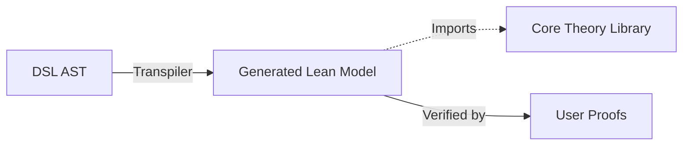

# Proposal 004: Lean 4 Integration for Problem Frames

## Status

Draft

## Position in Current Roadmap

This proposal defines the Lean research track details.
Near-term executable obligation checks in roadmap `007`/`010` run Alloy-first by default; Lean adoption remains non-blocking and parallel.

## Problem Statement

This document outlines a revised strategy for integrating [Lean 4](https://leanprover.github.io/) for formal verification of Problem Frames models. This approach prioritizes correctness, separation of concerns, and robust tooling.

## Core Principles

1.  **Research Track**: This integration is a parallel research track, **not** a replacement for the existing Rust-based validator in the short term.
2.  **Separate Lifecycle**: Lean code lives in a separate `theory/` directory and is checked by a dedicated CI job, decoupled from the main build pipeline.
3.  **No "Magic" Axioms**: Avoid generating `axiom ... : True`. Instead, generate unproven theorem stubs (`theorem ... : Prop := sorry`) that require explicit proof.
4.  **Robust Transpilation**: Use a dedicated `LeanEmitter` struct in Rust (not `fmt::Display`) to handle naming, escaping, and source mapping.

## Non-Goals

- Replacing the Rust validator on the interactive LSP path in the short term.
- Blocking regular feature delivery on full proof completion.
- Embedding raw Lean directly into `.pf` syntax during initial rollout.

## Architecture



## Phased Rollout

### Phase 0: Foundations & Formal Semantics
*   **Goal**: Define the mathematical meaning of PF concepts before writing a generator.
*   **Action**: Create `theory/ProblemFrames.lean`.
*   **Deliverable**: Formal definitions for `Domain`, `Interface`, `Phenomenon` (incorporating causality/synchrony), and `Requirement`.
*   **Key Decision**: Model constraints using **Linear Temporal Logic (LTL)** or a similar formalism to capture behavioral properties.

### Phase 1: Robust Transpilation
*   **Goal**: Generate syntactically correct and meaningful Lean code from `.pf` files.
*   **Action**: Implement `LeanEmitter` in `pf_dsl`.
    *   **Source Map**: Map PF spans to Lean declaration names for LSP diagnostics.
    *   **Type Safety**: Ensure generated Lean symbols are strictly typed.
*   **Deliverable**: CLI command `cargo run -- --gen-lean <file.pf>`.

### Phase 2: Verification Baseline
*   **Goal**: Prove basic consistency properties automatically.
*   **Action**:
    *   Compare Lean model properties against the Rust `validator` oracle.
    *   Auto-generate "sanity check" theorems (e.g., "All interfaces connect defined domains").
*   **Deliverable**: A CI job that builds the generated Lean code and checks proofs.

## Detailed semantics (Draft)

```lean
-- theory/ProblemFrames.lean

structure Domain where
  name : String
  kind : DomainKind

-- Interface defined as a set of shared phenomena
structure Interface where
  name : String
  domains : List Domain
  phenomena : List Phenomenon

-- A Requirement constrains the behavior of domains
structure Requirement where
  name : String
  constrains : Domain
  reference : Domain
  predicate : Behavior -> Prop -- TBD: Formalism for Behavior
```

## Success Criteria

- Lean generation for canonical PF examples is deterministic and buildable.
- At least one non-trivial property is proven over generated models.
- Differential checks with Rust validator catch or prevent semantic drift.
- Main CI and editor workflows keep current responsiveness.

## Risks & Mitigation

*   **Risk**: "Illusion of Proof" (axioms that are always true).
    *   *Mitigation*: Use `theorem ... := sorry` stubs.
*   **Risk**: Divergence between Rust semantic checks and Lean semantics.
    *   *Mitigation*: Phase 2 includes differential testing.
*   **Risk**: Performance overhead of Lean in CI.
    *   *Mitigation*: Run Lean checks efficiently, cache build artifacts, or run partially in parallel.

## Decision Needed

- Approve this proposal as the detailed execution plan for the formal verification track.
